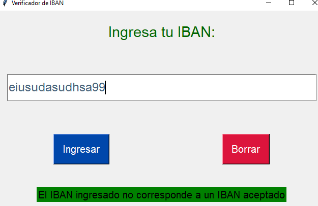

# Verificador IBAN

¡Bienvenido al repositorio del Verificador IBAN! Este proyecto utiliza Python y su librería Tkinter para verificar números de cuenta bancaria internacional (IBAN).

## Resultados

Aquí hay algunas capturas de pantalla que muestran los resultados del verificador IBAN:

  
  
  
  
  

## Tecnologías utilizadas

Este proyecto fue desarrollado utilizando las siguientes tecnologías:

¡Gracias por visitar este repositorio! Espero que encuentres útil este proyecto.
